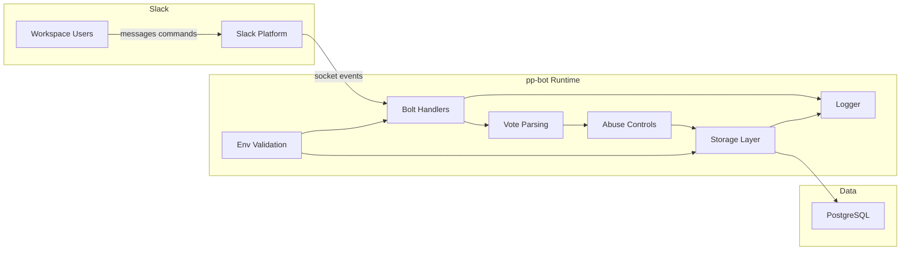

## Executive summary

For the stated use case (single small Railway service, non-enterprise, best-effort secure defaults), this branch materially improves baseline security with production DB TLS policy enforcement, `event_id`-first replay protection, abuse controls, retention maintenance, and log redaction. Residual risk is now mostly operational and opt-in: Slack token compromise, intentionally permissive runtime config (`ABUSE_ENFORCEMENT_MODE=monitor`), and explicit DB SSL override (`ALLOW_INSECURE_DB_SSL=true`).

## Scope and assumptions

- In-scope paths:
  - `src/index.ts`
  - `src/env.ts`
  - `src/security/abuse-controls.ts`
  - `src/security/db-ssl.ts`
  - `src/storage/database.ts`
  - `src/storage/maintenance.ts`
  - `src/scripts/migrate.ts`
  - `src/db.ts`
  - `src/logger.ts`
  - `src/utils/vote.ts`
  - `src/utils/sanitize.ts`
  - `.github/workflows/ci.yml`
  - `.github/workflows/codeql.yml`
  - `.github/workflows/secret-scan.yml`
- Out-of-scope:
  - Tests under `src/__tests__/`.
  - Non-runtime docs except where they define expected operational controls.
  - Downstream re-deployments that intentionally weaken defaults.
  - Enterprise-scale hardening for multi-tenant/high-compliance environments.
- Assumptions used for ranking:
  - Deployment remains Slack Socket Mode only (`socketMode: true`), with no public inbound webhook/API path.
  - Deployment is single-tenant (one Slack workspace) and currently low sensitivity.
  - Deployment is a single small Railway service (not horizontally scaled by design).
  - PostgreSQL is expected to be privately reachable from runtime.
  - Slack tokens are only in deployment secrets, not committed in git.
  - `ABUSE_ENFORCEMENT_MODE` should be `enforce` by default.
  - `ALLOW_INSECURE_DB_SSL` should remain `false` unless explicitly overridden.

Open questions that would materially change ranking:

- None for the current maintainer deployment model; risk increases if deployment goals change toward multi-tenant or enterprise requirements.

## System model

### Primary components

- Slack users and channels generate messages and slash commands.
- Slack platform delivers events to Bolt in Socket Mode (`src/index.ts`).
- Vote parser/sanitizer converts message text into structured vote actions (`src/utils/vote.ts`, `src/utils/sanitize.ts`).
- Abuse controller performs channel policy, per-message target limit, per-user/per-channel rate limit, pair cooldown, and daily downvote checks (`src/security/abuse-controls.ts`).
- Storage layer applies dedupe and score mutations via parameterized SQL (`src/storage/database.ts`).
- PostgreSQL stores leaderboard, vote history, and dedupe state (`src/scripts/migrate.ts`).
- Startup/runtime config validation enforces required env, token shape checks, and security config parsing (`src/env.ts`).

### Data flows and trust boundaries

- Slack User -> Slack Platform -> Bolt Message/Command Handler
  - Data types: message text, user IDs, channel IDs, message timestamp, `event_id`, slash command payload.
  - Channel/protocol: Slack-managed Socket Mode event channel.
  - Security guarantees: app token and bot token required for runtime connection/config (`src/index.ts:40-45`), bot/bot-message filtering (`src/index.ts:51`).
  - Validation/controls: vote parsing/sanitization (`src/utils/vote.ts:4-31`, `src/utils/sanitize.ts:7-29`), self-vote block (`src/index.ts:117-120`).

- Handler -> Abuse Controller -> Storage
  - Data types: voter identity, target identity/type, vote action, channel metadata.
  - Channel/protocol: in-process calls.
  - Security guarantees: channel allowlist and rate/cooldown/downvote limits (`src/security/abuse-controls.ts:185-271`), enforcement or monitor mode (`src/security/abuse-controls.ts:362-383`).
  - Validation/controls: message-level dedupe by `event_id` or legacy key (`src/index.ts:61-82`, `src/utils/dedupe.ts:11-20`), reservation rollback on write failure (`src/index.ts:156-180`, `src/security/abuse-controls.ts:314-337`).

- Runtime -> PostgreSQL
  - Data types: score updates, dedupe records, vote history, maintenance deletes.
  - Channel/protocol: PostgreSQL client connection.
  - Security guarantees: parameterized SQL queries (`src/storage/database.ts:223-256`), uniqueness constraints on dedupe and vote-history indexes (`src/scripts/migrate.ts:91-101`, `src/scripts/migrate.ts:135-137`).
  - Validation/controls: production SSL policy blocks insecure modes unless explicit override (`src/security/db-ssl.ts:104-120`, `src/db.ts:67-72`, `src/scripts/migrate.ts:24-48`).

- Operator/Platform -> Runtime
  - Data types: Slack tokens, DB URL, abuse/maintenance/TLS config.
  - Channel/protocol: environment variables.
  - Security guarantees: required env and placeholder checks (`src/env.ts:52-83`), config parse validation for maintenance and abuse controls (`src/env.ts:101-117`).
  - Validation/controls: startup failure on invalid/insecure policy combinations (`src/env.ts:119-121`).

#### Diagram

## Assets and security objectives

| Asset                                                      | Why it matters                                                                              | Security objective (C/I/A) |
| ---------------------------------------------------------- | ------------------------------------------------------------------------------------------- | -------------------------- |
| `SLACK_BOT_TOKEN` and `SLACK_APP_TOKEN`                    | Enables bot identity and Socket Mode connection; compromise allows impersonation and abuse  | C, I                       |
| `SLACK_SIGNING_SECRET`                                     | Secret required if HTTP-mode verification is introduced and still security-sensitive config | C                          |
| Leaderboard state (`leaderboard`, `thing_leaderboard`)     | Core product integrity and trustworthiness                                                  | I, A                       |
| Vote history + dedupe (`vote_history`, `message_dedupe`)   | Replay defense, abuse auditing, and score-change traceability                               | I, A                       |
| DB transport and credentials (`DATABASE_URL`, TLS mode/CA) | Protects confidentiality/integrity of persistence channel                                   | C, I                       |
| Abuse-control configuration                                | Determines practical resilience against spam/harassment manipulation                        | I, A                       |
| Runtime logs                                               | Needed for incident response; can leak secrets if redaction fails                           | C, A                       |

## Attacker model

### Capabilities

- Legitimate workspace user can submit arbitrary vote-like text and slash commands in reachable channels.
- Compromised workspace account can automate high-rate event generation.
- Operator configuration can weaken defaults (monitor mode or DB SSL override), but this is treated as explicit opt-out from secure defaults.
- Adversary with deployment secret access can act as bot/app.

### Non-capabilities

- Unauthenticated internet users do not have a direct runtime HTTP entrypoint in current Socket Mode architecture.
- SQL injection through vote message content is constrained by sanitization plus parameterized queries.
- Attackers cannot directly manipulate abuse-control internal state unless they can generate events through Slack or control deployment.

## Entry points and attack surfaces

| Surface                                            | How reached                                    | Trust boundary          | Notes                                                                 | Evidence (repo path / symbol)                                                                   |
| -------------------------------------------------- | ---------------------------------------------- | ----------------------- | --------------------------------------------------------------------- | ----------------------------------------------------------------------------------------------- |
| Message vote ingestion                             | Slack events containing `@user ++`/`@thing --` | Slack -> Runtime        | Highest-volume untrusted path; dedupe and abuse controls execute here | `src/index.ts:49-193`                                                                           |
| Replay dedupe keying                               | Slack event metadata (`event_id`, channel/ts)  | Slack -> Runtime -> DB  | Uses event-id first, fallback legacy key, rejects missing metadata    | `src/utils/dedupe.ts:11-20`, `src/index.ts:61-73`                                               |
| Slash commands (`/leaderboard`, `/score`, `/help`) | Slack command payload                          | Slack -> Runtime        | Read-heavy queries and informational responses                        | `src/index.ts:205-277`                                                                          |
| Abuse-control configuration                        | Environment variables                          | Operator -> Runtime     | Security impact depends on mode/limits/allowlist values               | `src/security/abuse-controls.ts:105-114`, `src/env.ts:112-117`                                  |
| DB connection and migration path                   | Startup + migrate script                       | Runtime -> DB           | SSL mode policy and CA handling determine transport security          | `src/db.ts:67-72`, `src/scripts/migrate.ts:24-48`, `src/security/db-ssl.ts:71-120`              |
| Maintenance cleanup                                | Startup and 12-hour timer                      | Runtime -> DB           | Controls table growth and availability posture                        | `src/index.ts:301-310`, `src/storage/maintenance.ts:65-122`                                     |
| Logging/error sink                                 | Runtime log calls                              | Runtime -> Log consumer | Redacts Slack tokens and DB URL passwords                             | `src/logger.ts:3-45`, `src/logger.ts:54-65`                                                     |
| CI security controls                               | GitHub Actions on PR/push/schedule             | Dev/CI boundary         | CodeQL, audit, and gitleaks are defense-in-depth                      | `.github/workflows/codeql.yml`, `.github/workflows/ci.yml`, `.github/workflows/secret-scan.yml` |

## Top abuse paths

1. **Bot-token compromise to impersonate trusted bot identity**
   1. Attacker gains token access from deployment secret store or privileged logs.
   2. Attacker posts as bot / drives app session behavior through granted Slack scopes.
   3. Workspace trust is degraded and sensitive conversations can be influenced.

2. **Vote manipulation under permissive abuse-control configuration**
   1. Operator deploys with `ABUSE_ENFORCEMENT_MODE=monitor` or weak thresholds.
   2. Attacker account sends frequent vote messages.
   3. Violations are logged but not blocked, causing score-integrity degradation.

3. **Abuse-control state reset on service sleep/restart**
   1. Service scales to zero or restarts and in-memory abuse state is lost.
   2. Attacker resumes voting after restart with fresh per-process counters.
   3. Cooldown/rate-limit continuity weakens across restarts.

4. **DB transport downgrade via explicit insecure override**
   1. Production deployment sets `ALLOW_INSECURE_DB_SSL=true` with non-`verify-full` mode.
   2. DB traffic traverses less-trusted network path.
   3. MITM or rogue endpoint risk increases for leaderboard/vote data.

5. **Table-growth pressure when maintenance controls are disabled/failing**
   1. `MAINTENANCE_ENABLED=false` or recurring cleanup errors are ignored.
   2. `vote_history`/`message_dedupe` growth continues under normal use or abuse.
   3. DB performance/cost degrades and availability incidents become more likely.

6. **Residual secret leakage through unrecognized log patterns**
   1. Application logs arbitrary error/object payloads.
   2. Redaction misses secret formats outside current token/DB-password patterns.
   3. Sensitive values may be exposed to log readers.

## Threat model table

| Threat ID | Threat source                                              | Prerequisites                                                                                                           | Threat action                                                                        | Impact                                                                                                | Impacted assets                                       | Existing controls (evidence)                                                                                                                                                                                   | Gaps                                                                                                                  | Recommended mitigations                                                                                                                       | Detection ideas                                                                                             | Likelihood | Impact severity | Priority |
| --------- | ---------------------------------------------------------- | ----------------------------------------------------------------------------------------------------------------------- | ------------------------------------------------------------------------------------ | ----------------------------------------------------------------------------------------------------- | ----------------------------------------------------- | -------------------------------------------------------------------------------------------------------------------------------------------------------------------------------------------------------------- | --------------------------------------------------------------------------------------------------------------------- | --------------------------------------------------------------------------------------------------------------------------------------------- | ----------------------------------------------------------------------------------------------------------- | ---------- | --------------- | -------- |
| TM-001    | External attacker with secret access or privileged insider | Access to Slack bot/app tokens through deployment plane, CI secret exposure, or operator endpoint compromise            | Authenticate as bot/app and perform trusted actions/events in workspace scope        | Message integrity compromise and potential confidentiality impact in channels reachable by bot scopes | Slack tokens, workspace trust, bot identity integrity | Required token env validation and placeholder rejection (`src/env.ts:52-83`); token redaction in logs (`src/logger.ts:3-15`); gitleaks workflow (`.github/workflows/secret-scan.yml`)                          | No in-app token rotation, no runtime attestation of expected workspace/team, dependence on external secret governance | Enforce least-privilege Slack scopes, periodic token rotation, tighter deployment IAM, and incident runbook for immediate revocation/redeploy | Alert on unusual bot posting volume, session anomalies, and scope/account changes in Slack audit logs       | Medium     | High            | high     |
| TM-002    | Malicious or compromised workspace member                  | Bot present in attacker-accessible channels and abuse controls configured permissively (`monitor` or high limits)       | Generate high-rate or targeted votes that would be blockable only in enforce mode    | Score manipulation and moderation burden                                                              | Leaderboard integrity, community trust                | Abuse-control engine supports per-message/user/channel/cooldown/downvote limits (`src/security/abuse-controls.ts:185-271`); handler enforces decisions (`src/index.ts:87-145`)                                 | Security posture can be reduced by config; no hard production assertion that enforce mode is required                 | Pin production to `ABUSE_ENFORCEMENT_MODE=enforce`, add config policy checks at deploy time, and maintain conservative thresholds             | Track `wouldBlock` vs blocked counts and per-user vote velocity; alert if wouldBlock > 0 while mode=monitor | Medium     | Medium          | medium   |
| TM-003    | Authenticated workspace member                             | Service scales to zero or restarts, resetting in-memory abuse counters                                                  | Resume abusive voting after restart windows to reduce cooldown/rate-limit continuity | Some integrity/abuse-control effectiveness loss; limited by small single-service topology             | Abuse-control integrity                               | Reservation model and rollback reduce local race issues (`src/security/abuse-controls.ts:274-337`, `src/index.ts:129-180`)                                                                                     | Abuse state is process-local and not persisted across restarts                                                        | Acceptable for current use case, or persist counters in shared store if stronger continuity is desired                                        | Track blocked-vote ratios over time and correlate with deploy/restart events                                | Low        | Medium          | low      |
| TM-004    | Network-position attacker plus explicit insecure override  | Production sets `ALLOW_INSECURE_DB_SSL=true` with `DB_SSL_MODE` set to `disable` or `require`, and DB path is untrusted | Intercept or tamper with DB traffic, or impersonate DB endpoint                      | Data integrity and confidentiality compromise in persistence path                                     | Vote/leaderboard data, DB credentials                 | Secure default `verify-full` in prod and policy assertion (`src/security/db-ssl.ts:37-40`, `src/security/db-ssl.ts:104-120`); used by runtime and migrator (`src/db.ts:67-72`, `src/scripts/migrate.ts:24-48`) | Insecure override remains available by design for edge deployments                                                    | Keep override opt-in and clearly documented; optionally log loudly when override is enabled                                                   | Alert when `ALLOW_INSECURE_DB_SSL=true` or `DB_SSL_MODE!=verify-full` in production                         | Low        | High            | low      |
| TM-005    | Any member (normal or abusive) plus weak operations        | Maintenance disabled or cleanup errors not acted on for long periods                                                    | Grow `vote_history`/`message_dedupe` over time until DB performance degrades         | Availability/cost pressure, mainly over longer horizons                                               | DB availability, historical integrity                 | Maintenance cleanup on startup + 12h scheduler (`src/index.ts:301-310`, `src/storage/maintenance.ts:65-122`); retention env validation (`src/env.ts:101-103`)                                                  | Maintenance can still be disabled intentionally                                                                       | Keep secure defaults enabled; optionally add lightweight table-size alerts                                                                    | Alert on maintenance failures and table growth slope                                                        | Low        | Medium          | low      |
| TM-006    | Insider or log-consumer attacker                           | Access to runtime logs and a logged secret format not matched by current redaction patterns                             | Extract sensitive values from error payloads/log objects                             | Confidentiality loss and follow-on credential abuse                                                   | Secrets in logs, operator trust boundary              | Redaction for Slack tokens and DB URL credentials with recursive object traversal (`src/logger.ts:3-45`)                                                                                                       | Redaction is pattern-based and may miss non-matching secret formats (e.g., arbitrary API keys)                        | Add key-name-based redaction (`token`, `secret`, `password`, `key`) and structured-logging allowlist; avoid logging raw config objects        | Scan logs for secret-like entropy/patterns and alert on matches                                             | Low        | Medium          | low      |

## Criticality calibration

- **critical**: compromise that gives broad, persistent control of bot identity or data with limited operator containment.
  - Example: attacker with bot/app token control plus privileged scopes across sensitive channels.
  - Example: exploitable code path enabling arbitrary command execution on runtime host.
- **high**: realistic attacks with major trust or security impact in normal deployment.
  - Example: token compromise with effective bot impersonation (TM-001).
  - Example: severe abuse-control misconfiguration allowing sustained manipulation at scale.
- **medium**: meaningful but bounded risk requiring certain deployment or operational preconditions.
  - Example: abuse-limit continuity loss across scale-to-zero restarts (TM-003).
- **low**: edge-case or constrained impact scenarios with existing mitigation layers.
  - Example: DB transport downgrade only when insecure override is intentionally enabled (TM-004).
  - Example: table-growth pressure when maintenance is intentionally disabled for long periods (TM-005).
  - Example: residual secret leakage from uncommon log patterns after existing redaction (TM-006).
  - Example: low-rate nuisance vote behavior contained by current thresholds.

## Focus paths for security review

| Path                                | Why it matters                                                                                   | Related Threat IDs     |
| ----------------------------------- | ------------------------------------------------------------------------------------------------ | ---------------------- |
| `src/index.ts`                      | Main trust-boundary crossing path for Slack events, dedupe flow, and abuse enforcement decisions | TM-002, TM-003         |
| `src/security/abuse-controls.ts`    | Core anti-abuse logic and configuration semantics (`monitor` vs `enforce`)                       | TM-002, TM-003         |
| `src/utils/dedupe.ts`               | Replay/idempotency key construction logic for event processing                                   | TM-002                 |
| `src/storage/database.ts`           | Persistence mutation paths and dedupe write behavior                                             | TM-003, TM-005         |
| `src/storage/maintenance.ts`        | Retention deletion logic and scheduler behavior affecting DB growth risk                         | TM-005                 |
| `src/security/db-ssl.ts`            | TLS mode policy, CA parsing, and insecure override handling                                      | TM-004                 |
| `src/db.ts`                         | Runtime DB pool initialization and enforcement of SSL policy at connect time                     | TM-004                 |
| `src/scripts/migrate.ts`            | Migration-time DB policy enforcement and schema constraints                                      | TM-004, TM-005         |
| `src/logger.ts`                     | Redaction coverage and residual log secrecy risk                                                 | TM-006                 |
| `src/env.ts`                        | Startup policy gate for invalid/unsafe security configuration                                    | TM-002, TM-004, TM-005 |
| `.github/workflows/secret-scan.yml` | Secret scanning control that reduces token-leak introduction risk                                | TM-001                 |
| `.github/workflows/codeql.yml`      | Static analysis control for regression detection in JS/TS paths                                  | TM-001, TM-006         |
| `.github/workflows/ci.yml`          | Dependency audit and test/build guardrails affecting security hygiene                            | TM-001, TM-005         |

## Quality check

- Covered all discovered entry points: message events, slash commands, startup config ingestion, DB migration path, and logging sink.
- Represented each trust boundary in threats: Slack->runtime (TM-001/TM-002/TM-003), runtime->DB (TM-003/TM-004/TM-005), operator->runtime (TM-001/TM-002/TM-004).
- Kept runtime attack surface separate from CI/dev controls (CI listed as defense-in-depth, not primary runtime path).
- Reflected known maintainer context (single small service, best-effort defaults, non-enterprise target).
- Re-ranked threats to reflect implemented remediations in this branch.
